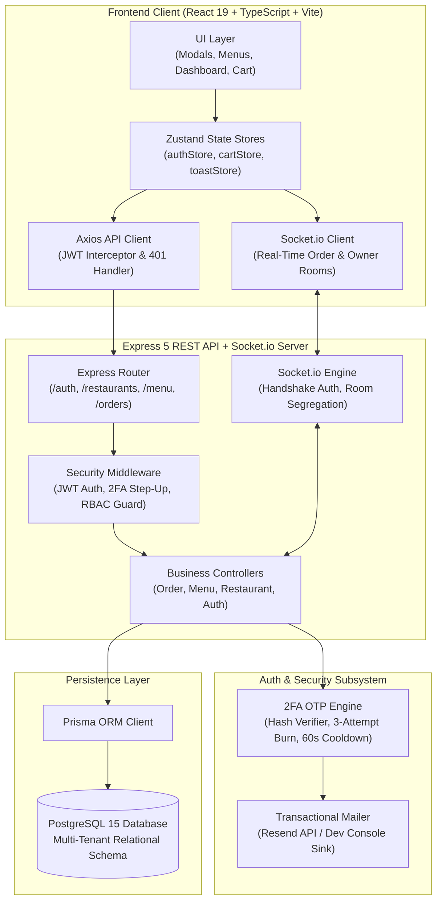

# 🍽️ OrderFlow — Enterprise Multi-Restaurant Food Ordering & Real-Time Fulfillment Engine

[](https://github.com/shatwiks/Food-Full-stack/actions/workflows/ci.yml)
[](https://www.typescriptlang.org/)
[](https://nodejs.org/)
[](https://react.dev/)
[](https://vitejs.dev/)
[](https://www.prisma.io/)
[](https://www.postgresql.org/)
[](https://socket.io/)
[](https://www.docker.com/)
[](https://vitest.dev/)

**OrderFlow** is a full-stack, multi-tenant food ordering platform and real-time restaurant fulfillment system engineered with a security-first posture, database-authoritative billing, and low-latency WebSocket state propagation.

---

## 🏛️ Core Design Principles

1. **Security-First Architecture**: Mandatory two-factor authentication (2FA OTP) step-up workflow, bcrypt password hashing, rotating JWT access/refresh tokens with database-level revocation, and strict multi-tenant Role-Based Access Control (RBAC).
2. **Database-Authoritative Integrity**: Zero trust in client calculations. All order prices, item modifiers, and status transitions are mathematically calculated and validated server-side against immutable database records.
3. **Event-Driven & Scoped Real-Time**: Scoped WebSocket room segregation (`order:<id>` and `restaurant:<id>`) ensuring instant order state propagation with zero cross-tenant data leakage.

---

## 📐 System Architecture



---

## 🔐 Security Architecture Deep-Dive

### 1. 2FA Step-Up Authentication State Machine
Authentication employs a two-phase credential validation process:
- **Phase 1 (`POST /api/auth/login`)**: Validates email and bcrypt password hash. Instead of returning a full session token, the server returns a restricted, short-lived `preAuthToken` (scoped strictly to 2FA verification) and generates a cryptographically random 6-digit OTP code hashed with SHA-256.
- **Phase 2 (`POST /api/auth/verify-2fa`)**: The client presents the `preAuthToken` alongside the 6-digit OTP. Upon successful hash comparison, full `accessToken` and database-persisted `refreshToken` pairs are issued.

### 2. Brute-Force & Flooding Protection
- **3-Attempt Burn Policy**: Failed OTP attempts increment an atomic counter. Upon the 3rd failed attempt, the OTP record is permanently invalidated, requiring re-authentication.
- **60-Second Cooldown**: Rate limiting prevents OTP generation spamming and email flooding.

### 3. Database-Authoritative Pricing (Anti-Tampering)
Client checkout payloads strictly submit item IDs and quantities:
```json
{
  "restaurantId": "cly123456",
  "items": [{ "menuItemId": "item_abc", "quantity": 2 }]
}
```
The server queries the database for active prices and executes calculations within a database transaction:
$$\text{Total Amount} = \sum (\text{DB Price}_i \times \text{Quantity}_i)$$
Any client-supplied prices are completely discarded, preventing parameter tampering and financial fraud.

### 4. Multi-Tenant RBAC Boundary Enforcement
Every mutating endpoint verifies ownership claims against database relations:
- `RESTAURANT_OWNER` can only modify menu items and status of orders belonging to restaurants matching `ownerId == req.user.id`.
- `CUSTOMER` can only view and track orders where `userId == req.user.id`.
- Unauthorized cross-tenant mutations immediately return `403 Forbidden`.

---

## ⚡ Real-Time Order Tracking

Order state transitions follow an explicit finite state machine:
$$\text{PENDING} \longrightarrow \text{CONFIRMED} \longrightarrow \text{PREPARING} \longrightarrow \text{OUT\_FOR\_DELIVERY} \longrightarrow \text{DELIVERED}$$

### Room Segregation Strategy
- **Customer Tracker**: Connected clients join `order:<orderId>`. When the restaurant owner updates the order status, the server broadcasts an `order_status_updated` event exclusively to that room.
- **Owner Dashboard**: Owners join `restaurant:<restaurantId>`. When a new order is submitted, a `new_order` event is dispatched in real-time without polling.

---

## 🛠️ Tech Stack & Monorepo Structure

```text
orderflow/
├── .github/workflows/ci.yml    # GitHub Actions CI pipeline (Postgres service, tests, lint)
├── docker-compose.yml          # PostgreSQL 15 container definition
├── backend/
│   ├── prisma/
│   │   ├── schema.prisma       # Relational models (User, Restaurant, MenuItem, Order, Otp)
│   │   └── migrations/         # Version-controlled SQL migrations
│   ├── src/
│   │   ├── controllers/        # Business logic & request validation
│   │   ├── middleware/         # JWT Auth, RBAC guards, error handling
│   │   ├── routes/             # RESTful API route definitions
│   │   ├── socket.ts           # WebSocket connection handling & room events
│   │   └── app.ts / server.ts  # Express app entry points
│   └── tests/                  # Vitest integration & security suites
├── frontend/
│   ├── src/
│   │   ├── api/client.ts       # Axios client with bearer token interceptor
│   │   ├── components/         # Modals, drawers, navigation, menus
│   │   ├── pages/              # Responsive customer and owner views
│   │   ├── store/              # Zustand global state stores
│   │   └── styles.css          # Modern, responsive design system
└── package.json                # Monorepo workspace orchestration
```

---

## 🚀 Local Development Quickstart

### Prerequisites
- [Node.js](https://nodejs.org/) (v20.x or higher)
- [Docker & Docker Compose](https://www.docker.com/)

### 1. Clone & Configure Environment
```bash
git clone https://github.com/shatwiks/Food-Full-stack.git
cd Food-Full-stack

# Copy environment variables
cp backend/.env.example backend/.env
cp frontend/.env.example frontend/.env
```

### 2. Start PostgreSQL via Docker Compose
```bash
docker compose up -d
```

### 3. Install Dependencies & Run Database Migrations
```bash
# Install all monorepo dependencies
npm install

# Run Prisma migrations & generate client
npm run prisma:migrate
npm run prisma:generate
```

### 4. Start Development Servers
```bash
# Terminal 1: Backend API (runs on port 3001)
npm run backend:dev

# Terminal 2: Frontend Client (runs on port 5173)
npm run frontend:dev
```
Open **[http://localhost:5173](http://localhost:5173)** in your browser.

---

## 🧪 Automated Testing & CI/CD Pipeline

The project includes an end-to-end integration and security test suite built with **Vitest** and **Supertest**.

### Run Test Suite Locally
```bash
cd backend
npm test
```

### Continuous Integration (GitHub Actions)
Every pull request and push to the **`master`** branch triggers the automated CI pipeline:
1. Provisions a dedicated `postgres:15-alpine` container service.
2. Applies Prisma database migrations (`npx prisma migrate deploy`).
3. Executes backend TypeScript type-checking and linting.
4. Executes frontend production bundle compilation (`npm run build`).
5. Runs the integration test suite validating the 2FA lifecycle, RBAC rules, price calculation integrity, and WebSocket handlers.

---

## 💡 Engineering Trade-Offs & Scalability (Interview Talking Points)

### 1. In-Memory Socket.io vs. Redis Pub/Sub Adapter
- **Current Choice**: Single-instance Socket.io in-memory room adapter for development simplicity and zero additional infrastructure dependencies.
- **Scale Path**: In a multi-instance horizontal cluster behind a load balancer, instances cannot broadcast to rooms on sibling nodes. Upgrading requires `@socket.io/redis-adapter` or `@socket.io/redis-streams-adapter` to distribute room messages across the cluster.

### 2. Synchronous Transactional Email vs. Asynchronous BullMQ Worker
- **Current Choice**: Synchronous dispatch via Resend API / development console sink with a 60-second rate-limiting cooldown.
- **Scale Path**: Under high concurrency, external SMTP/HTTP latencies block request threads. A production scale-out moves email dispatch to an asynchronous Redis-backed message queue (BullMQ) with automated retries, exponential backoff, and Dead-Letter Queue (DLQ) routing.

### 3. Token Storage & Session Security
- **Current Choice**: Access tokens stored in client application state / local storage for cross-origin flexibility.
- **Hardening Path**: Storing refresh tokens in `SameSite=Strict`, `HttpOnly`, `Secure` cookies prevents client-side script access (XSS mitigation), while access tokens remain strictly in-memory.
